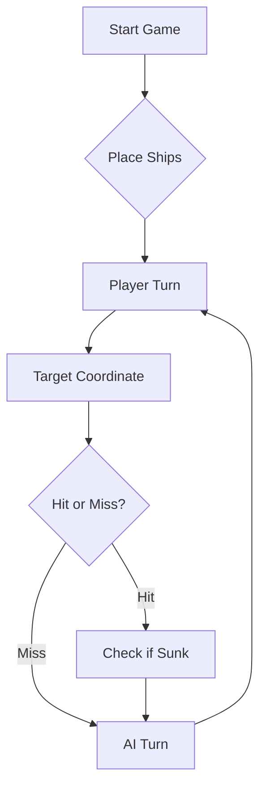

# Problema no lab 3 - Inspeção, métricas e cheiros no código


## Problema em questão

Como estamos a utilizar a versão não paga (gratuita) do SonarQube Cloud, apenas nos é permitido analisar o branch main, como podemos ver pela imagem acima.

Posto isto, cada um de nós vai proceder a realizar um printscreen de uma parte diferente da análise, nomeadamente das seguintes:
- **Issues** -> _branch main - Blocker Severity_
- **Issues** -> _branch main - High Severity - Maintainability - Cognitive Complexity_
- **Issues** -> _branch main - Info Severity_
- **Issues** -> _pull request 28 - erro intencional HuggingFaceClient.java_

---

# Questão sobre QODANA_TOKEN

Existiram problemas com o QODANA_TOKEN que nos impediram de realizar o trabalho, como queríamos, a tempo (23h59 de 05/04).

Devido a estes impasses, acabámos por ficar com o ficheiro _qodana.yaml_ (muito) simplificado, ao invés do mais completo que se perdeu (propositadamente) entre tentativas de resolver os problemas, nomeadamente a incompatibilidade de versões (provavelmente), visto termos obtido o seguinte erro:

- _Unexpected keys in qodana.yaml: [qualityGates, inspections]_

Posto isto, pedimos a vossa compreensão, e que contem com o (pouco) trabalho realizado após a hora final. Obrigado!

---

## Nota sobre a tarefa 1

Francisco Silva - 1110323: "Como eliminei a branch na qual fiz a feature do gamerportpdf no guião 2, no guião 3 vou realizar a tarefa 1 usando a branch da feature da integração de LLM que criei, calculando as métricas a partir do ultimo commit dessa branch."

---

# ⚓ Battleship 2.0


> A modern take on the classic naval warfare game, designed for the XVII century setting with updated software engineering patterns.

---

## 📖 Table of Contents
- [Project Overview](#-project-overview)
- [Key Features](#-key-features)
- [Technical Stack](#-technical-stack)
- [Installation & Setup](#-installation--setup)
- [Code Architecture](#-code-architecture)
- [Roadmap](#-roadmap)
- [Contributing](#-contributing)

---

## 🎯 Project Overview
This project serves as a template and reference for students learning **Object-Oriented Programming (OOP)** and **Software Quality**. It simulates a battleship environment where players must strategically place ships and sink the enemy fleet.

### 🎮 The Rules
The game is played on a grid (typically 10x10). The coordinate system is defined as:

$$(x, y) \in \{0, \dots, 9\} \times \{0, \dots, 9\}$$

Hits are calculated based on the intersection of the shot vector and the ship's bounding box.

---

## ✨ Key Features
| Feature | Description | Status |
| :--- | :--- | :---: |
| **Grid System** | Flexible $N \times N$ board generation. | ✅ |
| **Ship Varieties** | Galleons, Frigates, and Brigantines (XVII Century theme). | ✅ |
| **AI Opponent** | Heuristic-based targeting system. | 🚧 |
| **Network Play** | Socket-based multiplayer. | ❌ |

---

## 🛠 Technical Stack
* **Language:** Java 17
* **Build Tool:** Maven / Gradle
* **Testing:** JUnit 5
* **Logging:** Log4j2

---

## 🚀 Installation & Setup

### Prerequisites
* JDK 17 or higher
* Git

### Step-by-Step
1. **Clone the repository:**
   ```bash
   git clone [https://github.com/britoeabreu/Battleship2.git](https://github.com/britoeabreu/Battleship2.git)
   ```
2. **Navigate to directory:**
   ```bash
   cd Battleship2
   ```
3. **Compile and Run:**
   ```bash
   javac Main.java && java Main
   ```

---

## 📚 Documentation

You can access the generated Javadoc here:

👉 [Battleship2 API Documentation](https://britoeabreu.github.io/Battleship2/)


### Core Logic
```java
public class Ship {
    private String name;
    private int size;
    private boolean isSunk;

    // TODO: Implement damage logic
    public void hit() {
        // Implementation here
    }
}
```

### Design Patterns Used:
- **Strategy Pattern:** For different AI difficulty levels.
- **Observer Pattern:** To update the UI when a ship is hit.
</details>

### Logic Flow


---

## 🗺 Roadmap
- [x] Basic grid implementation
- [x] Ship placement validation
- [ ] Add sound effects (SFX)
- [ ] Implement "Fog of War" mechanic
- [ ] **Multiplayer Integration** (High Priority)

---

## 🧪 Testing
We use high-coverage unit testing to ensure game stability. Run tests using:
```bash
mvn test
```

> [!TIP]
> Use the `-Dtest=ClassName` flag to run specific test suites during development.

---

## 🤝 Contributing
Contributions are what make the open-source community such an amazing place to learn, inspire, and create.

1. Fork the Project
2. Create your Feature Branch (`git checkout -b feature/AmazingFeature`)
3. Commit your Changes (`git commit -m 'Add some AmazingFeature'`)
4. Push to the Branch (`git push origin feature/AmazingFeature`)
5. Open a **Pull Request**

---

## 📄 License
Distributed under the MIT License. See `LICENSE` for more information.

# Prompt para IA
Considere agora a seguinte tática de geração de rajadas de tiros:
## Diário de Bordo
Crie um Diário de Bordo com o registo de cada rajada disparada, numerando-as sequencialmente (Rajada 1, 2, 3...). Guarde as coordenadas exatas de cada rajada e o respetivo resultado (Água, Nau atingida, Barca afundada, etc.). A memória é a principal arma de um bom estratega. Guarde o Diário de Bordo desta forma:
•	{"rajada":1,"coordenadas":["A1","D6","G9"],"resultado":"3 Misses","observacoes":"","contadores": "Barcas a flutuar: 4; Caravelas a flutuar: 3; Naus a flutuar: 2; Fragatas a flutuar: 1; Galeões a flutuar: 1"} 
•	{"rajada":2,"coordenadas":["B6","E2","H4"],"resultado":"1 Hit (Nau); 2 Misses","observacoes":"usar Target Mode; testar ortogonais do hit","contadores": "Barcas a flutuar: 4; Caravelas a flutuar: 3; Naus a flutuar: 2; Fragatas a flutuar: 1; Galeões a flutuar: 1"} 
•	{"rajada":3,"coordenadas":["C2","F4","I6"],"resultado":"2 Hits (1 Nau; 1 Fragata); 1 Miss","observacoes":"confirmar posições dos hits; priorizar Target Mode para cada hit","contadores": "Barcas a flutuar: 4; Caravelas a flutuar: 3; Naus a flutuar: 2; Fragatas a flutuar: 1; Galeões a flutuar: 1"}
## Evitar tiros inválidos e repetições
Não dispare fora dos limites do mapa (ex: Z99) nem repita tiros em coordenadas já testadas – verifique o Diário de Bordo para conseguir evitar estes erros. A única exceção para este desperdício de pólvora é a última rajada do jogo, apenas para perfazer os 3 tiros obrigatórios quando a frota inimiga já estiver irremediavelmente no fundo do mar. 
## Procedimento após atingir navios
•	Acertou apenas um tiro: Escolha uma coordenada da rajada e dispare nas posições contíguas (Norte, Sul, Este, Oeste) para descobrir a orientação da embarcação e acabar de a afundar
•	Acertou mais do que um tiro: Escolha uma coordenada adjacente de cada uma das 3 coordenadas da rajada, de modo a explorar mais do que um ponto de contacto. Por exemplo: se acertou dois tiros na rajada A2-D4-J7, experimente A3-E4-I7 na rajada seguinte, explorando uma adjacência de todos os pontos anteriores
## Regras após afundamento
Se uma rajada confirmar que um navio foi afundado, não dispare para as posições contíguas (ortogonais e diagonais) porque os navios nunca estão encostados nem diagonalmente - marque essas casas como água e reduza a contagem dessa embarcação no seu Diário de Bordo. Além disso, como Caravelas, Naus e Fragatas ocupam linhas retas, um tiro certeiro indica que o resto do navio está na horizontal ou na vertical, pelo que deve continuar a procurar nessa direção em vez de disparar nas diagonais. 
As posições diagonais a um tiro certeiro são garantidamente água (a única exceção é o corpo do Galeão, devido à sua forma em T). Evitar essas diagonais e as casas contíguas a navios afundados poupa imensos tiros.
## Marcação do halo de água
Quando o relatório de uma rajada confirmar que um navio foi afundado, analise os dados do seu Diário de Bordo para identificar exatamente onde reside a carcaça da embarcação. Confirmada a posição exata da carcaça, marque todas as quadrículas contíguas (o halo de 1 posição em redor do navio) como água intransitável. É impossível haver outra embarcação nesse perímetro.
## Declaração de fim de jogo
Se a sua frota for toda afundada, declare a derrota com honra. Em contrapartida, seja um vencedor magnânimo se for o inimigo a render-se com os navios todos no fundo do oceano!

# Links para os vídeos do YouTube
https://youtu.be/4-C8CIBvnPE
https://youtu.be/VkcgKGBzlhs

---
**Maintained by:** [@britoeabreu](https://github.com/britoeabreu)  
*Created for the Software Engineering students at ISCTE-IUL.*
